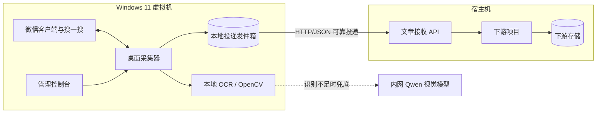
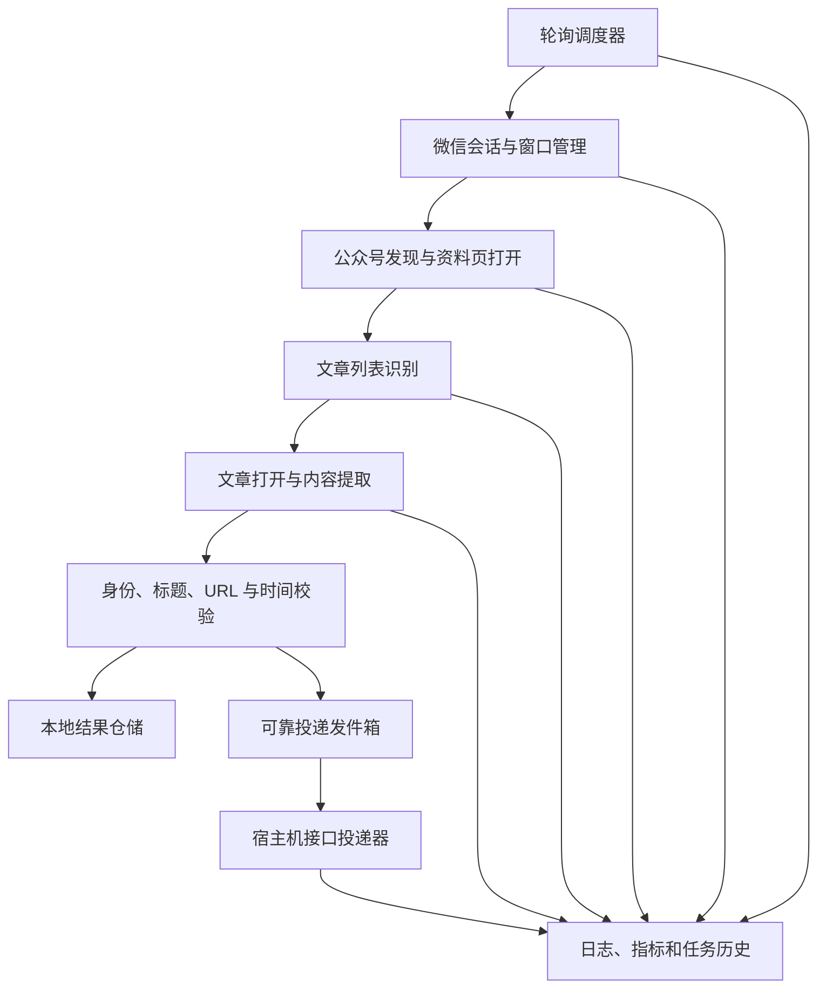
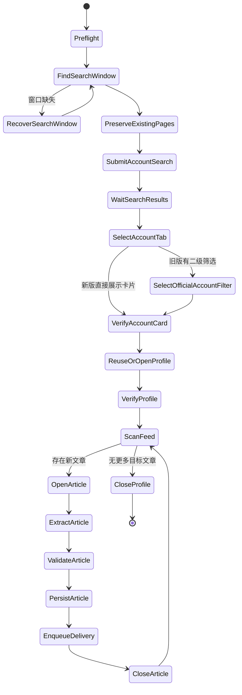

# 微信公众号持续采集系统架构

## 1. 文档目的

本文描述微信公众号文章采集器的当前实现、目标架构、模块边界和演进路径。

目标运行场景：

- 采集器运行在 Windows 11 虚拟机的交互式桌面中；
- 通过已登录的微信客户端和“搜一搜”页面轮询约 100 个公众号；
- 发现最新文章后提取标题、正文、公众号、发布时间和文章 URL；
- 将文章可靠地传输到宿主机中的另一个项目；
- 允许后续扩展更多识别模型、输出目标、调度策略和采集字段。

本文使用以下状态标记：

- **已实现**：当前代码中已有完整路径；
- **部分实现**：已有主要能力，但未完成当前 Windows 11 环境的闭环验证；
- **规划**：目标架构要求，当前代码尚未实现。

## 2. 当前完成度

| 能力 | 状态 | 当前实现与限制 |
|---|---|---|
| Windows 桌面自动化 | 部分实现 | 已实现 Win32 窗口枚举、激活、移动、截图、鼠标键盘操作；兼容资料页独立窗口和搜一搜浏览器内嵌标签；Windows 11 尚未完成完整闭环验收 |
| 识别和恢复“搜一搜”窗口 | 部分实现 | 能识别微信浏览器窗口，缺失时可从微信主窗口尝试恢复 |
| 搜索指定公众号 | 部分实现 | 已能输入名称并提交搜索；支持搜索结果加载重试、一级“账号”分类安全兜底，以及新版无二级筛选栏的直接公众号卡片校验；Windows 11 仍需现场完成连续闭环验收 |
| 公众号资料页文章识别 | 已实现代码路径 | 本地 OCR 优先，Qwen-VL 兜底；需在当前微信版本现场验证 |
| 文章标题与正文提取 | 已实现 | 复制文章 URL 后请求微信文章页面，解析标题、正文、公众号和发布时间 |
| 数据校验与去重 | 已实现 | 校验 URL、账号和标题；使用规范化 URL 幂等去重 |
| 本地结果保存 | 已实现 | 每篇文章追加写入 JSONL/CSV，并保存截图、识别结果和运行日志 |
| MongoDB 入库 | 已实现 | 可写入 `weixin.article`，互动数据以历史快照追加 |
| 约 100 个公众号批量执行 | 部分实现 | 可从 MongoDB 或文件读取账号并串行处理，但尚未完成规模和长时间稳定性验证 |
| 持续监测 | 未实现 | 当前是单次有限批处理或固定时刻定时任务，不是持续轮询服务 |
| 宿主机文章接收接口 | 未实现 | 当前没有文章级 HTTP 推送、Webhook 或消息队列适配器 |
| 可靠投递与失败重试 | 未实现 | 已有采集失败文件，但没有宿主机接口的持久化发件箱、重试和死信机制 |
| 模块化扩展 | 部分实现 | OCR、视觉模型和入库已有独立文件，但主流程仍集中在 `wechat_visual_rpa.py` |

当前 Windows 11 实测进度：

```text
识别搜一搜窗口
  -> 输入公众号名称
  -> 等待搜索结果加载并重试本地 OCR
  -> 选择并验证一级“账号”分类
  -> 兼容旧版“公众号”二级筛选 / 新版直接公众号卡片
  -> 精确校验公众号卡片后点击资料页
```

因此，当前项目已进入“Windows 11 单账号闭环现场验证”阶段，尚未达到“100 个公众号持续采集并实时推送”的生产状态。

## 3. 部署拓扑

### 3.1 目标拓扑



### 3.2 运行边界

- 微信 UI 自动化只能在 Windows 交互式用户会话中运行；不能放入无桌面的 Linux 容器。
- 采集期间 Windows 不得锁屏、休眠、注销或改变分辨率与缩放比例。
- 鼠标和键盘由采集器独占，同一时间只允许一个 UI 采集任务。
- MongoDB 可以运行在 Windows VM、宿主机或其他可信内网节点。
- Qwen 视觉模型通过 OpenAI 兼容的 `/v1/chat/completions` 接口访问。
- 宿主机文章接收 API 只接收结构化文章数据，不参与微信桌面控制。

## 4. 当前代码模块

| 模块 | 当前职责 |
|---|---|
| `wechat_visual_rpa.py` | 采集主流程、窗口管理、鼠标键盘操作、公众号循环、文章打开与关闭、校验和日志 |
| `wechat_profile_ocr.py` | 搜一搜页面、账号分类、公众号筛选、资料页和浏览器菜单的本地识别 |
| `wechat_feed_ocr.py` | 已关注公众号消息列表和时间分组识别 |
| `wechat_ocr.py` | 微信固定界面搜索框和搜索结果识别 |
| `interaction_ocr.py` | 文章底部互动栏模板匹配和 OCR |
| `article_evidence_ocr.py` | 文章标签标题和正文大标题证据识别 |
| `qwen_vision.py` | OpenAI 兼容视觉模型调用及结构化 JSON 解析 |
| `article_ingest.py` | 微信文章网页解析、正文清洗、URL 规范化、本地导出和 MongoDB 入库 |
| `rpa_control_panel.py` | 启动前检查、手动任务、固定时刻调度、任务状态、日志和管理 API |
| `web/` | 控制台、公众号管理和文章管理页面 |

### 4.1 当前主要耦合

`wechat_visual_rpa.py` 同时承担以下职责：

- Windows UI 适配；
- 搜一搜页面状态机；
- 公众号和文章调度；
- 文章内容采集；
- 重试、清理和运行日志；
- MongoDB 与本地导出调用。

该结构适合验证单机闭环，但不利于持续轮询、可靠投递和新增输出目标。目标架构应逐步拆分，而不是一次性重写。

## 5. 目标逻辑架构



### 5.1 计划拆分的服务边界

#### DesktopSession

负责：

- 微信窗口枚举、角色确认、激活和布局；
- 屏幕、DPI、锁屏和窗口可见性检查；
- 截图、点击、键盘输入和剪贴板；
- 搜一搜页面和文章标签的安全恢复。

不负责公众号业务规则和文章传输。

#### AccountNavigator

负责：

- 输入公众号搜索名；
- 选择一级“账号”，并按微信版本选择二级“公众号”或直接使用新版公众号结果卡片；
- 严格校验公众号名称；
- 通过资料页截图顶部名称验证资料页，不依赖窗口标题；新版微信若将资料页作为搜一搜浏览器的活动标签打开，则把同一 `Chrome_WidgetWin_0` 标记为 `embedded_profile_tab`，不再要求出现独立资料窗口；
- 资料页确认后立即保存基线截图；后续每次截图、滚屏和清理前都按页面内容重新激活目标标签，不能只激活窗口句柄；
- 打开并验证资料页。

本地 OCR 多次失败后，允许 Qwen-VL 识别精确标签或卡片，但所有模型坐标必须经过标签、置信度、区域和后续页面身份校验。

#### FeedScanner

负责：

- 读取时间分组和文章卡片；
- 本地 OCR 只有在文章标题与“阅读/赞”指标锚点同时存在时才直接产出点击候选；资料页头部、纯数字和封面文字视为噪声，无锚点时交给 Qwen-VL 复核；
- 判断今天、昨天和历史边界；
- 跳过推广内容；
- 生成待打开文章候选；
- 保持单轮卡片去重。

#### ArticleCollector

负责：

- 打开文章；
- 复制并验证文章 URL；
- 解析标题、正文、公众号和发布时间；
- 识别互动指标；
- 校验文章打开前后的 URL 一致；
- 安全关闭文章标签。

#### ArticleRepository

负责：

- 规范化文章 URL；
- MongoDB 幂等写入；
- JSONL/CSV 追加导出；
- 查询已有文章，避免重复下载完整正文。

#### DeliveryOutbox

负责：

- 将已验证文章写入 Windows VM 本地持久化发件箱；
- 保存投递次数、下次重试时间和最后错误；
- 采集进程重启后继续投递；
- 将永久失败记录转入死信区。

建议使用 Python 标准库 SQLite 实现本地发件箱，避免宿主机网络中断时丢失文章，也不新增运行依赖。

#### HostDeliveryClient

负责：

- 调用宿主机文章接收 API；
- 设置鉴权和幂等键；
- 按错误类别重试；
- 记录投递延迟和响应摘要；
- 支持后续增加其他输出适配器。

## 6. 采集状态机

单个公众号采用以下状态机：



搜索初始化、资料页和文章页采用不同的清理边界：搜索初始化只定位并固定搜一搜页面，
不关闭已有资料页或未知标签；目标卡片确认后才决定复用已有同名资料页或打开新资料页；
文章采集过程中只关闭已确认的文章标签；账号任务结束时才关闭本次确认过的资料页标签或窗口。

### 6.1 状态安全原则

- 未确认微信进程、窗口类名和页面角色时不点击。
- 窗口标题只能作为候选线索；资料页必须通过截图中的目标公众号名称校验。
- 未确认一级“账号”已选中且未确认公众号名称与官方内容证据时不点击账号卡片。
- 搜索初始化不得把公众号资料页或未知页面当作旧文章标签关闭。
- 公众号资料页若与搜一搜共用浏览器窗口，只能用标签级 `Ctrl+W` 关闭，不能关闭窗口句柄；本地 OCR 不确定时先用 Qwen-VL 只读确认资料页名称，确认失败后也只能回退到安全的标签级重试。
- 清理前若无法再次确认资料页标签，则保留全部标签并停止当前账号，禁止把当前搜一搜标签当作资料页关闭。
- 公众号名称不匹配时终止该账号，不采用模糊点击。
- 文章 URL、账号和标题校验失败时不持久化、不投递。
- 文章标签无法安全关闭时停止当前公众号，避免后续文章错配。
- 网络投递失败不得阻断微信页面清理；文章先进入本地发件箱，再异步投递。

## 7. 持续轮询约 100 个公众号

### 7.1 当前方式

当前采集器会读取一批账号，串行采集完成后退出。控制台支持每天固定时间启动任务，但不支持按分钟持续轮询。

### 7.2 目标方式

由于一个微信桌面只能串行操作，持续监测应采用“轮询调度”，而不是并发打开多个公众号。

建议为每个账号保存：

```text
account_name
enabled
search_alias
poll_interval_seconds
last_started_at
last_success_at
last_finished_at
next_due_at
consecutive_failures
last_error_category
last_seen_publish_time
```

调度规则：

1. 从 `collection_target` 读取启用账号；
2. 按 `next_due_at` 和失败优先级取下一个账号；
3. 每次只采集一个账号；
4. 正常账号按配置间隔再次入队；
5. 网络或页面加载失败使用短退避重试；
6. 名称错误、账号不存在等配置错误进入人工处理状态；
7. 每完成一篇文章立即写入本地仓储和投递发件箱；
8. 每完成一个账号保存检查点，进程重启后从下一个账号继续。

### 7.3 “实时”的定义

100 个账号在单一桌面会话中无法真正并发。系统的发现延迟为：

```text
单账号平均处理耗时 × 本轮实际检查账号数 + 重试和页面加载耗时
```

上线前必须通过实测确定一轮 100 个账号的耗时，再约定业务 SLA。若要求分钟级发现，需要拆分为多台 Windows 采集节点和多个独立微信会话；单 VM 不应通过并发鼠标操作扩容。

## 8. 宿主机文章接收接口

### 8.1 建议接口

```http
POST /api/v1/wechat/articles
Content-Type: application/json
Authorization: Bearer <token>
Idempotency-Key: <event_id>
```

建议请求体：

```json
{
  "event_id": "sha256:...",
  "event_version": 1,
  "run_id": "20260828-162000-...",
  "source": "wechat-desktop-rpa",
  "collected_at": "2026-08-28T16:20:00+08:00",
  "account": {
    "id": "RPA_XIAMEN_DAILY",
    "name": "厦门日报"
  },
  "article": {
    "title": "文章标题",
    "url": "https://mp.weixin.qq.com/s/...",
    "url_normalized": "https://mp.weixin.qq.com/s/...",
    "publish_time": "2026-08-28T15:30:00+08:00",
    "content_text": "正文纯文本"
  },
  "interaction": {
    "share_count": 12,
    "like_count": null,
    "favorite_count": null,
    "comment_count": null,
    "recognition_method": "template-ocr-share-only"
  }
}
```

### 8.2 幂等规则

- `event_id` 建议由 `source + normalized_url + 内容版本` 生成；
- 宿主机必须对 `event_id` 建立唯一约束；
- 重复请求返回 `200`、`201` 或 `409` 均可视为已确认，具体由接口契约确定；
- 正文补全或字段更新应使用新的内容版本，或提供单独的更新接口。

### 8.3 重试规则

| 情况 | 行为 |
|---|---|
| 连接失败、超时 | 指数退避重试 |
| HTTP 408、429 | 按响应头或退避策略重试 |
| HTTP 500–599 | 重试 |
| HTTP 400、401、403、404、422 | 不无限重试，进入死信并报警 |
| HTTP 200、201、202、204 | 标记已投递 |
| 明确约定的重复响应 | 标记已投递 |

建议退避范围从 5 秒逐步增加到 10 分钟，并加入随机抖动。宿主机恢复后按创建顺序补发。

### 8.4 建议配置

现有配置：

```text
QWEN_VL_BASE_URL
QWEN_VL_API_KEY
QWEN_VL_MODEL
QWEN_VL_ALLOW_NO_AUTH
MONGO_URI
MONGO_DATABASE
MONGO_ARTICLE_COLLECTION
MONGO_TARGET_COLLECTION
```

规划新增：

```text
HOST_INGEST_URL=http://宿主机地址:端口/api/v1/wechat/articles
HOST_INGEST_TOKEN=
HOST_INGEST_TIMEOUT_SECONDS=15
HOST_INGEST_ENABLED=true
DELIVERY_MAX_ATTEMPTS=0
DELIVERY_MAX_BACKOFF_SECONDS=600
DELIVERY_OUTBOX_PATH=output/delivery-outbox.sqlite3
CONTINUOUS_COLLECTION_ENABLED=true
DEFAULT_POLL_INTERVAL_SECONDS=3600
```

`DELIVERY_MAX_ATTEMPTS=0` 表示网络类错误持续重试；鉴权和数据格式错误仍进入死信。

## 9. 数据一致性

### 9.1 文章唯一标识

以规范化后的微信公众号文章 URL 作为文章主要幂等键。标题不能作为唯一键，因为标题可能重复、截断或修订。

### 9.2 写入顺序

推荐顺序：

```text
文章校验成功
  -> 本地/MongoDB 持久化
  -> 写入本地投递发件箱
  -> 关闭文章窗口
  -> 异步投递宿主机
  -> 收到确认后标记 delivered
```

只有文章持久化和发件箱写入都成功，才能认为该篇文章采集完成。宿主机暂时不可用不会导致文章丢失，也不会长期占用微信文章窗口。

## 10. 可靠性与可观测性

### 10.1 已有能力

- 结构化 JSON 日志；
- 账号级和文章级有限重试；
- 单篇截图、URL、标题和互动栏证据；
- 部分账号结果检查点；
- 任务历史和控制台实时进度；
- JSONL 按文章追加，长任务中断时保留已采集结果。

### 10.2 需要补齐

- 新旧搜一搜结果布局的兼容性回归与 Windows 现场验收；
- 一级“账号”及公众号结果卡片的视觉模型安全兜底；
- 持续调度检查点和进程重启恢复；
- 宿主机投递发件箱、重试和死信；
- 每账号最近成功时间和连续失败次数；
- 采集周期耗时、文章发现延迟和投递延迟指标；
- Windows 锁屏、分辨率变化、微信退出登录的明确告警；
- 100 个账号长时间运行的资源和稳定性测试。

## 11. 安全设计

- 控制台默认只监听 `127.0.0.1`；局域网开放时必须使用管理员认证和防火墙来源限制。
- Qwen 内网无鉴权模式只允许用于可信网络，公网接口不得启用。
- 宿主机文章接口应使用 Bearer Token 或 HMAC 签名，并限制 Windows VM 来源地址。
- API Token、MongoDB 密码和模型凭据只存于 `.env` 或系统密钥管理，不写入代码和日志。
- 日志不得记录 Token、Cookie 和完整 Authorization 头。
- 截图和正文属于业务数据，应设置保留周期并限制共享目录权限。
- 不允许两台机器同时控制同一个微信会话或重复运行同一账号批次。

## 12. 扩展点

目标架构应为以下能力保留接口：

- 新视觉模型供应方；
- 新微信客户端版本的页面适配器；
- HTTP、MongoDB、消息队列等多种文章输出适配器；
- 账号级不同轮询频率和优先级；
- 新增图片、视频封面、作者位置和更多互动指标；
- 多 Windows 采集节点的账号分片；
- 下游摘要、分类、检索和日报系统。

下游内容处理不应进入桌面 UI 采集主进程。采集器只负责获得可信原始文章并可靠交付。

## 13. 分阶段实施计划

### M1：Windows 11 单账号最小闭环

- 搜索结果加载采用状态等待和重试；
- 本地 OCR 未找到“账号”时使用受限的 Qwen-VL 兜底；
- 完成“厦门日报 → 资料页 → 最新文章 → 标题/正文 → 本地 JSONL”的一次闭环；
- 不写 MongoDB、不调用宿主机接口，先验证 UI 正确性。

完成标准：连续多次执行均能打开正确公众号和正确文章，且无误点、无残留文章标签。

### M2：文章可靠传输闭环

- 明确宿主机 API 地址、鉴权和响应契约；
- 实现文章事件模型；
- 增加 SQLite 投递发件箱和异步投递器；
- 增加幂等、重试和死信测试。

完成标准：宿主机暂时停止后重新启动，Windows VM 能自动补发且不重复创建文章。

### M3：持续轮询

- 增加账号调度状态；
- 支持轮询间隔、失败退避和重启恢复；
- 控制台展示当前账号、下一账号、本轮进度和预计完成时间。

完成标准：控制台常驻后可以连续执行多轮，无需人工重新启动批处理命令。

### M4：100 个账号稳定性验收

- 导入约 100 个真实账号；
- 测量无更新账号和有更新账号的平均耗时；
- 运行至少一个完整业务周期；
- 统计搜索失败、资料页失败、文章失败和投递失败；
- 根据实测数据确定轮询间隔和发现延迟 SLA。

### M5：工程化与扩展

- 从 `wechat_visual_rpa.py` 拆出窗口会话、账号导航、文章采集和调度模块；
- 建立状态机回归测试、接口契约测试和持续集成；
- 增加多节点账号分片和统一监控能力。

## 14. 建议验收清单

### 单账号闭环

- 能确认正确的搜一搜窗口；
- 能选择“账号 → 公众号”；
- 能打开名称完全匹配的公众号资料页；
- 能识别今天最新文章；
- 能提取非空标题、正文、发布时间和 URL；
- 能关闭文章标签并回到正确页面；
- 能生成完整证据和结构化日志。

### 可靠投递

- 每篇文章在本地持久化后立即进入发件箱；
- 宿主机返回成功后标记已投递；
- 网络中断期间文章不丢失；
- 网络恢复后自动补发；
- 重复投递不会在宿主机生成重复文章；
- 鉴权或格式错误进入死信并在控制台显示。

### 持续运行

- 所有启用账号在一个轮询周期内都被调度；
- 单账号失败不阻断后续账号；
- 进程重启后能恢复账号调度和未投递文章；
- 页面、窗口或登录状态异常能够停止危险点击并保留现场；
- 运行日志可以定位到账号、文章和状态阶段。
