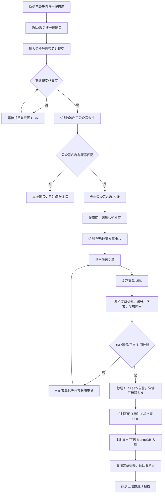
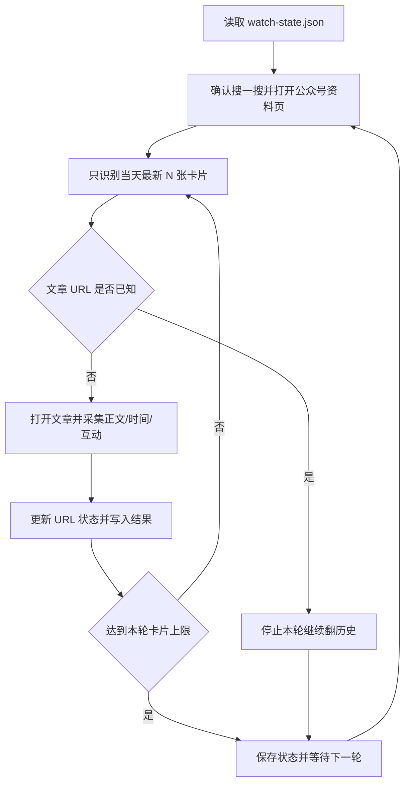
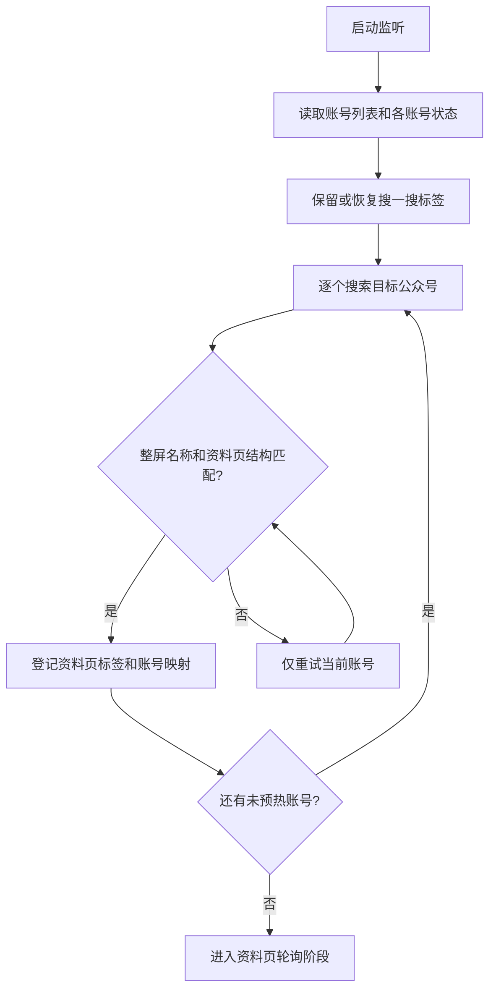
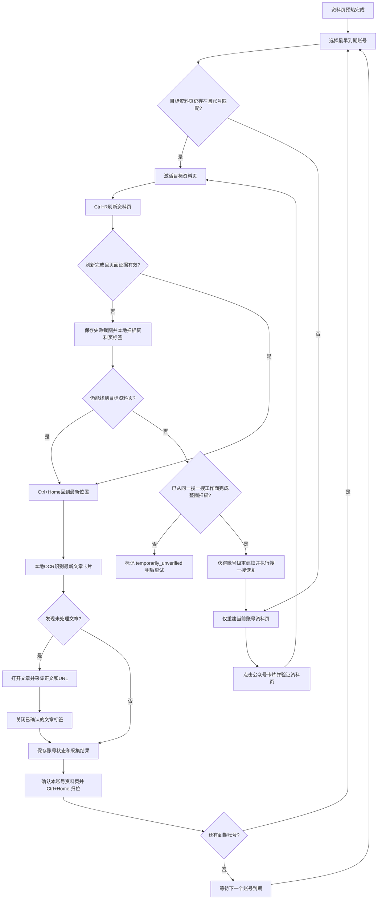

# 微信搜一搜公众号文章采集流程

> **文档状态：当前有效（唯一采集流程基线）**
> 搜索、标签管理、资料页缓存、多账号轮询、文章采集和失败恢复均以本文为准。标有“已归档”的其他文档或章节不得用于实现、排障或测试预期。

## 1. 文档用途

本文记录当前项目在 Windows 11 微信桌面客户端中，通过“搜一搜”窗口采集指定公众号文章的实际流程、页面识别方式、校验边界、去重规则、失败恢复和冒烟测试方法。

这是实现维护文档，不是目标架构设计。后续增加、删除或修改采集步骤时，必须同步更新本文对应章节，并补充或调整离线回归测试。旧流程不能仅因仍存在于 Git 历史或归档文档中而恢复；确需恢复时，必须先重新验证并将其写回本文。

当前适用入口：

```powershell
.venv\Scripts\python.exe wechat_visual_rpa.py --run-search-accounts --live --account-name "厦门日报" --max-articles 1 --scan-range today --metrics share --output-dir ".\output\smoke-test-win11"
```

## 2. 当前运行边界

- 采集器运行在 Windows 11 虚拟机的交互式桌面中。
- 微信必须已登录，并已打开或能够打开“搜一搜”。
- 采集器独占鼠标、键盘和微信窗口；运行期间不要人工操作。
- 当前 Win11 微信页面主要使用内置 Chromium，搜一搜和公众号资料页可能共用同一个 `Chrome_WidgetWin_0` 窗口，并通过标签页切换页面。
- 当前固定适配的 Win11 微信主界面为“左侧竖向功能栏 + 左侧会话列表 + 右侧聊天区”布局；主界面全局搜索框位于左侧会话栏顶部，约占窗口归一化坐标 `x=18.5%、y=8.0%`。从主界面恢复搜一搜时使用专用 OCR/布局定位，不再使用旧版主界面坐标。
- 页面识别以截图、本地 OCR、模板匹配和必要的内网 Qwen-VL 复核为主，不依赖浏览器 DOM。
- `--max-articles 1` 表示每个公众号最多成功采集一篇文章，不表示只扫描一张资料页截图。

## 3. 最小闭环



最小闭环的成功标准是：日志出现 `article_collect_succeeded`，并且对应文章目录中存在 `collection.json`、`verification.json` 和文章证据截图。仅看到公众号资料页或复制到 URL，不算文章采集成功。

## 4. 分阶段实际流程

### 4.1 启动与窗口准备

入口位于 `wechat_visual_rpa.py` 的账号采集流程。启动后会：

1. 读取命令行、账号文件或 MongoDB 中的账号。
2. 记录 `run_started`，包括参数、输出目录和源码指纹 `source_fingerprint`。
3. 检查微信窗口、进程名、屏幕尺寸和可见性。
4. 将搜一搜窗口排列到可识别区域。
5. 保留已有资料页和未知标签，不在搜索初始化阶段把资料页误当作旧标签关闭。

同一批次的后续账号会复用已经确认的搜一搜窗口：上一账号完成资料页清理后，下一账号先确认当前标签仍有搜一搜搜索框。当前标签不一定是第一个标签，程序不再假设固定标签顺序，也不发送标签移动快捷键。首次启动、当前标签不确定或恢复流程仍执行页面内容扫描，并记录 `search_window_hot_reused` 或恢复事件。

公众号资料页关闭后，当前活动标签可能回到“搜一搜首页”，而不是保留上一次的结果页。首页现在作为合法的搜一搜工作面识别，先确认搜索框和首页分类导航，再输入下一账号；搜索按钮 OCR 失败时使用绿色按钮视觉区域兜底，不会因此误判为需要重建窗口。

如果搜一搜窗口丢失，恢复顺序是：激活/检查现有微信窗口 → 使用 Win11 主界面左上角全局搜索框输入“搜一搜” → 回车打开内置搜一搜 → 等待并验证新的搜一搜窗口。恢复坐标和识别方法会记录在 `wechat_main_search_box_fallback` 或 `sogou_recovery_succeeded` 事件中。

Win11 中不能只用窗口标题或 HWND 判断页面。搜一搜、资料页和文章页都可能显示标题“微信”，因此页面角色必须通过截图内容和标签探测确认。

### 4.2 搜索公众号

当前 Win11 优先走新版“全部”页路径：

1. 识别并激活搜一搜搜索框。
2. 粘贴公众号搜索名，点击搜索按钮或按回车提交；提交动作本身不发送 `Esc`。
3. 使用 OpenCV 短轮询等待搜索栏从首页中央布局切换到结果页顶部布局，未完成切换时不运行整屏 OCR。
4. 结果页布局出现后保存 `search-after-submit-before-escape-*.png`。如果输入框仍有绿色聚焦描边，发送 `Esc`；若焦点仍未释放，再点击网页顶部右侧的安全空白区。
5. 连续两次确认输入框已经失焦后，保存 `search-after-submit-*.png` 并记录 `search_suggestion_dismiss_confirmed`。发送过按键但未通过验证时，不得记录“已关闭”。
6. 只有联想层关闭确认完成后才循环等待结果内容加载并运行公众号卡片 OCR。
7. 自动提交最多尝试三轮；前两轮不调用 Qwen-VL，避免把联想下拉框截图送入模型。
8. 优先在“全部”页的“关键词 - 账号”区域识别公众号卡片。
9. 如果新版直接卡片路径未命中，再识别顶部“账号”分类。
10. 对每一个同名结果按独立卡片边界读取类型，禁止上方视频号借用下方公众号或服务号的证据。
11. 同一次搜索必须合并名称完全匹配和“名称+媒体/官方”等安全后缀匹配，再固定优先选择“公众号”；完全没有公众号候选时才选择“服务号”；明确标记为“视频号”的同名结果永远不点击，“视频号∞”等类型文字与图标合并的 OCR 结果也按视频号排除。名称是否完全一致只在相同账号类型内部作为次级排序条件，不能让完全同名视频号压掉带安全后缀的公众号。旧版公众号筛选结果若只显示“个人”，可由同卡片的“篇原创内容”确认其公众号身份。`account_search_result` 会记录 `candidate_types`、最终 `account_type` 和 `selection_policy`，用于核对实际点击对象。
12. “公众号/服务号”类型优先级只用于搜索结果选卡；进入资料页后不要求页面继续显示账号类型或服务简介。
13. 只有出现 `search_result_page_confirmed`，才认为真正进入结果页。

自动提交三轮仍失败时，默认保留现场并让当前账号失败；值守测试时可增加
`--manual-search-fallback`，程序会等待最多 120 秒，由人工在当前搜一搜窗口完成搜索，
检测到目标结果页后继续执行后续公众号和文章采集。该选项不适合无人值守批量任务。

名称校验允许搜索结果出现“媒体”等展示后缀，但文章归属始终使用账号配置中的标准名称。例如：

```text
配置账号：厦门日报
搜索结果：厦门日报 媒体
文章页账号：厦门日报
```

### 4.3 打开并确认公众号资料页

公众号卡片通过名称区域或头像点击。点击后会：

1. 记录 `profile_name_clicked` 或头像回退点击事件。
2. 枚举微信窗口和 Chromium 标签。
3. 在独立资料窗口或搜一搜内嵌资料标签中寻找目标页面。
4. 使用整屏 OCR 的账号名称与资料页结构联合确认页面身份。
5. 记录 `profile_opened_and_verified`。
6. 为资料页保存基线截图 `profile-opened.png`。

资料页确认的强条件是页面内容中的账号名称匹配，而不是窗口标题或顶部单一区域。名称可以出现在资料页可视区域内，但还必须同时具备资料页结构证据：例如“关注/私信”以及位于同一导航行的“全部/贴图/文章/视频号”。服务类账号资料页可能完全不显示“服务号”类型和服务简介，这两项不得作为资料页确认条件。若同一帧仍出现绿色按钮文字“搜索”或“搜索词-账号”等结果页证据，即使输入框、结果卡片中存在账号名，也必须判为搜一搜页面。只在搜索结果、相关文章或文章正文中看到同名文字不能判定为资料页。若资料页是搜一搜浏览器内嵌标签，目标对象标记为 `embedded_profile_tab`，后续必须先激活该标签再截图、滚动或点击。

点击账号卡片后，如果当前活动标签的 OCR 没有立即确认资料页，程序会先扫描同一 Chromium 窗口的其他标签，并用整屏账号名称与资料页结构逐个确认。只有达到有界扫描上限仍无法确认时，才允许调用 Qwen-VL 做只读复核，之后才进入头像重试或搜索页恢复；扫描过程记录为 `profile_tab_probe`，成功恢复记录为 `profile_tab_recovered`。`found=false` 只代表当前截图未通过该阶段的页面证据，不等同于关闭或不存在资料页。

如果资料页确认失败，不应直接关闭搜一搜窗口。应先保存窗口清单、探测截图和失败原因，再按账号搜索重试策略处理。每次失败还会记录 `profile_detection_attempt`，其中包含 OCR 读到的顶部候选和资料页结构证据（如“关注”“全部”“文章”“视频号”），用于区分“页面不存在”和“OCR/活动标签误判”。

### 4.4 识别资料页文章卡片

`analyze_profile_window()` 先使用本地 OCR，识别：

- “今天”“昨天”等时间分组；
- 文章标题和标题区域坐标；
- 可选的阅读数、点赞数；
- 推广、置顶或非文章卡片特征。

资料页头部名称、纯数字、封面内文字和互动数字不是文章标题。缺少“阅读/赞”锚点时，仍允许本地 OCR 输出文章候选并先点击文章；互动锚点只用于补充列表指标，不是打开文章的前置条件。存在同卡片“阅读/赞”锚点时，允许“图解政策”等 2～4 字短标题，不再套用无锚点自由文本的 5 字降噪门槛。

如果本地 OCR 已识别到“星期四”“8月17日”等明确早于扫描范围的日期，但当前屏没有文章候选，应当作为“扫描范围内没有新文章”正常结束，记录 `profile_feed_local_empty_range`，不得触发 Qwen-VL，也不得把账号轮次记为 OCR 失败。只有日期仍属于 `today`/`yesterday` 目标范围但文章候选缺失时，才进入 Qwen-VL 兜底。

当本地 OCR 结果没有足够的时间分组或文章候选时，且允许 VL，才请求 Qwen-VL 复核资料页。Qwen-VL 的坐标仍需经过页面区域、账号身份和文章页面结果校验，不能直接盲点。

时间规则：

- `today`：资料页先筛选“今天”，文章页再按真实发布时间复核；
- `yesterday`：资料页先筛选“昨天”，文章页再次复核；
- `today_yesterday`：允许两类时间分组；
- 遇到明确的星期、年月日或更早日期边界时停止继续翻页；
- 没有本屏日期证据的卡片标记为 `ungrouped`，不猜测其归属日期。

### 4.5 打开文章与提取正文

每个候选文章卡片按以下顺序处理：

1. 激活资料页目标标签。
2. 点击文章卡片标题区域。
3. 等待文章页面加载。
4. 通过“复制链接”取得公众号文章 URL。
5. 规范化 URL，并检查本轮是否已处理过。
6. 请求文章页面，解析真实标题、公众号、发布时间和正文。
7. 校验账号、正文非空、发布时间范围。
8. 保存文章证据截图并识别底部互动指标。
9. 再次复制文章 URL，确认采集互动指标期间页面没有切换。
10. 将文章写入本地导出文件；启用 MongoDB 时执行幂等入库。
11. 记录 `article_collect_succeeded`，关闭文章标签并返回资料页。

文章详情页是最终数据来源：

- `page.title` 是最终文章标题；
- `page.account_name` 是最终公众号名称；
- `page.content` 是最终正文；
- `page.publish_time` 是扫描范围的最终判断依据；
- 复制链接得到的规范化 URL 是文章唯一身份。

### 4.6 等待策略与热窗口

等待不再以固定睡眠时间作为成功条件，主要状态闸门如下：

- 窗口激活：轮询前台句柄，确认窗口置前后只保留短暂渲染缓冲；
- 窗口移动：轮询实际窗口矩形，达到目标位置后立即继续；标签顺序不调整，搜一搜通过 `Ctrl+Tab` 扫描并停留在已确认的当前标签；
- 搜索提交：提交后立即进行第一次结果截图，未加载完成时按递增间隔重试；
- 文章点击：比较点击前后的标签栏/页面截图，检测到明显导航变化后立即进入 URL 复制；超时仍走原有复制链接校验；
- 资料页滚动：保留懒加载缓冲，由下一次 OCR 结果决定是否继续，不依赖固定等待作为页面成功依据。

这些优化只减少无效等待，不放宽页面身份校验。文章标签仍必须逐篇关闭并确认回到资料页；搜一搜主窗口不作为文章清理对象。当前环境默认禁用 `Ctrl+Shift+PageUp` 标签移动，因为无法可靠确认该快捷键在 Win11 微信中生效。恢复流程找到搜一搜后直接保留该标签，不要求它位于首标签；清理阶段遇到未确认标签时保留现场，不批量关闭未知标签。

## 5. 标题校验策略

资料页卡片标题来自 OCR，可能出现：

- 卡片显示省略号；
- 多行标题只识别到最后一行；
- 标题开头或末尾被封面、互动指标遮挡；
- 单个汉字或 AI/Al 等字符误识别。

因此当前策略是：

1. 继续计算 `titles_match()` 和 `title_similarity_score()`。
2. 匹配成功或失败都记录到 `verification.json` 和运行日志。
3. 标题不匹配只记录 `article_card_title_mismatch_warning`，不再阻断已经通过 URL、账号、正文和发布时间校验的文章。
4. 文章详情页标题覆盖卡片 OCR 标题，卡片标题只保留为 `expected_card_title` 诊断信息。

标题不能承担去重职责。否则会出现“详情页已经正确打开，但因卡片 OCR 不完整而漏抓”的情况。

## 6. 去重与漏抓保护

### 6.1 唯一身份

文章唯一身份按以下优先级处理：

```text
规范化文章 URL > 文章页真实标题 > 资料页卡片 OCR 标题
```

URL 规范化会统一协议、域名大小写、查询参数顺序并移除片段。文章详情页成功解析后，批次内 URL 集合用于后续重复卡片判断；MongoDB 使用 `article.urlNormalized` 查询和幂等写入。

### 6.2 卡片指纹的限制

日期分组、卡片标题和阅读/点赞数据仍会作为审计指纹，但不在点击前跳过候选。原因是：

- 同一文章在相邻滚屏中可能因 OCR 截断不同而产生不同指纹；
- 不同文章可能拥有相同标题；
- 不同文章的标题和互动数字也可能暂时相同；
- 只有点击后才能得到可靠 URL。

因此重复卡片允许被点击一次，取得 URL 后再跳过。这样会增加少量重复点击，但优先保证不同 URL 的文章不被错误合并或漏掉。

### 6.3 三类结果

| 结果 | 处理方式 |
|---|---|
| 新 URL，详情页校验成功 | 采集、导出或入库，登记本轮 URL |
| 已出现的 URL | 记录 `article_skipped_duplicate_url`，不重复写文章 |
| 详情页 URL、账号、正文或时间校验失败 | 关闭文章标签，按文章重试次数处理；最终写入失败队列 |

`--max-articles` 只统计成功采集的文章；重复 URL 和超出扫描范围的文章不会占用成功文章名额。

## 7. 重试、清理和失败证据

### 7.1 重试层级

- 搜索公众号：最多三次账号搜索尝试；
- 资料页 OCR：本地 OCR 多次尝试，必要时 Qwen-VL 兜底；
- 文章打开与解析：同一卡片最多三次文章尝试；
- 文章标签清理失败：停止当前公众号，避免旧标签造成文章错配；
- 账号级失败：保存 `summary.json` 或部分检查点，继续后续账号或由控制台重试。

批量账号之间不启动并发鼠标任务。热窗口只是复用同一个已确认的搜一搜会话；任何页面身份不确定时，必须退出热路径，执行完整标签探测或安全恢复。

### 7.2 清理原则

文章处理无论成功、跳过还是异常，都会进入标签清理流程。清理时必须保留资料页目标标签。正常路径只关闭已确认的当前文章标签；恢复路径只扫描并保留已确认的搜一搜标签，不依赖首标签或标签移动快捷键，也不批量关闭未知标签，否则可能误关搜一搜或公众号资料页。

### 7.3 应保留的诊断文件

发生失败时，优先保留：

- `run.log`；
- `search-after-submit.png`、`search-after-submit-*.png`、`search-result.png`；
- `profile-opened.png`、`profile-window-local-*.png`；
- `feed.json`；
- `article_evidence.png`、`article_footer.png`；
- `verification.json`、`collection.json`；
- `attempt-*-error.txt`；
- `summary.json`、`partial-summary.json`。

不要复用历史输出目录。每次冒烟测试使用新的 `--output-dir`，避免旧截图和 JSON 混入本次结果。

## 8. 运行日志关键事件

| 事件 | 含义 |
|---|---|
| `run_started` | 本次任务启动，含参数和源码指纹 |
| `search_box_detection` | 搜一搜搜索框识别结果 |
| `sogou_search_tab_probe` | 使用 `Ctrl+Tab` 逐个探测当前窗口标签 |
| `sogou_search_tab_selected` | 已找到搜一搜并停留在该当前标签；不代表标签已移动到首位 |
| `search_submitted` | 已提交公众号搜索 |
| `search_submit_attempt_failed` | 本轮提交后仍未确认结果页 |
| `search_result_page_confirmed` | 已确认进入真实结果页 |
| `account_card_directly_selected` | Win11“全部”页直接选中公众号卡片 |
| `search_manual_fallback_requested` / `search_manual_fallback_succeeded` | 请求人工搜索 / 已检测到人工完成的结果页 |
| `account_card_directly_selected` | Win11“全部”页直接选中公众号卡片 |
| `profile_opened_and_verified` | 已打开并验证资料页 |
| `profile_feed_local_succeeded` | 本地 OCR 识别出资料页文章候选 |
| `profile_feed_local_empty_range` | 本地 OCR 只看到扫描范围外日期，正常零更新结束 |
| `vl_fallback_requested` | 本地识别不足，触发 Qwen-VL |
| `article_url_copied_before` | 打开文章后首次复制 URL |
| `article_page_parsed` | 已解析文章详情页 |
| `article_card_title_mismatch_warning` | 卡片 OCR 标题与详情页标题不一致，仅告警 |
| `article_skipped_duplicate_url` | 规范化 URL 已在本轮出现，跳过重复处理 |
| `article_collect_succeeded` | 一篇文章完整采集成功 |
| `article_tab_cleanup_failed` | 文章标签清理失败，通常应停止当前账号 |
| `article_tabs_cleanup_finished` | 恢复阶段已确认并保留搜一搜标签，未知标签未批量关闭 |
| `watch_cycle_started` / `watch_cycle_finished` | 增量监听一轮开始 / 完成 |
| `incremental_known_url_stop` | 遇到已知 URL，按最新到最旧规则结束本轮 |
| `watch_cycle_failed` / `watch_sleeping` | 监听轮次失败 / 等待下一轮 |

## 9. 冒烟测试验收

使用一个公众号、最多一篇文章：

```powershell
.venv\Scripts\python.exe wechat_visual_rpa.py --run-search-accounts --live --account-name "厦门日报" --max-articles 1 --scan-range today --metrics share --output-dir ".\output\smoke-test-win11-YYYYMMDD-HHMM"
```

验收顺序：

1. `run_started` 的 `source_fingerprint` 已产生；
2. 出现 `search_result_page_confirmed`；
3. 出现 `profile_opened_and_verified`；
4. 出现 `profile_feed_local_succeeded` 或合理的 `vl_fallback` 成功事件；
5. 出现 `article_url_copied_before` 和 `article_page_parsed`；
6. 文章详情页账号、正文和发布时间通过校验；
7. 标题不匹配时只出现 warning，不应因此重复打开同一 URL；
8. 出现 `article_collect_succeeded`，`summary.json` 中 `collected` 数量为 1；
9. 文章标签关闭后搜一搜/资料页仍可用。

批量性能测试时，第二个及后续账号应在日志中看到 `search_window_hot_reused`。若出现页面恢复、资料页标签探测失败或窗口尺寸变化，热路径会自动失效，不能以牺牲页面安全为代价强行复用。

## 10. 增量监听模式

常驻监听统一由多账号调度器负责。单账号监听是账号列表只有一项的兼容场景，仍复用同一套 Win11 搜一搜→公众号资料页→文章详情页闭环；每轮只检查当天最新的有限数量卡片，避免每次从历史文章重新翻页。

### 10.1 启动命令

```powershell
.venv\Scripts\python.exe wechat_visual_rpa.py --watch-account "厦门日报" --live --poll-interval 300 --recent-card-limit 3 --metrics share --output-dir ".\output\watch-xiamen"
```

- `--watch-account` 可重复传入；也可以使用 `--watch-accounts-file`，每行一个公众号。只有一个账号时，调度器仍保持单账号目录和状态文件兼容。
- `--accounts-per-vm` 是单个虚拟机允许的账号上限，默认 10；超过上限应拆分到另一台虚拟机。
- `--poll-interval` 是两轮之间的间隔，最小 30 秒，默认 300 秒。
- `--recent-card-limit` 是每轮最多检查的当天文章卡片数，默认 3；它不是成功文章数。
- `--watch-cycles 1` 或 `--watch-cycles 2` 表示完成 1 或 2 个账号轮询周期；默认 `0` 表示持续运行，按 `Ctrl-C` 停止。
- 建议生产运行传入 `--write-mongo`。不传时仍会本地导出，但跨重启去重主要依赖状态文件。

单虚拟机监听多个账号：

```powershell
.venv\Scripts\python.exe wechat_visual_rpa.py --watch-accounts-file ".\config\watch-accounts.txt" --live --local-only --accounts-per-vm 10 --poll-interval 600 --recent-card-limit 1 --metrics share --output-dir ".\output\watch-vm-01"
```

若需要每天 07:30 到 24:00 采集，增加时间窗口参数：

```powershell
.venv\Scripts\python.exe wechat_visual_rpa.py --watch-account "厦门日报" --live --watch-start-time 07:30 --watch-end-time 24:00 --poll-interval 600 --recent-card-limit 10 --metrics share --write-mongo --output-dir ".\output\watch-xiamen-day"
```

时间按北京时间解释。达到 24:00 后不再开启新一轮；如果当前文章仍在采集，会先完成当前轮次、关闭文章标签并保存 `watch-state.json`，随后进程留在等待状态，次日 07:30 自动恢复。程序不会在午夜强制关闭微信或被任务计划程序杀掉。

### 10.2 单轮流程



资料页必须按最新到最旧的顺序展示文章。监听器遇到第一篇已知 URL 时，假设后续卡片都是历史文章并停止本轮；如果未来微信改变排序，应关闭该停止规则后再上线。

### 10.3 状态、去重与输出

监听目录中的 `watch-state.json` 保存：账号名、已知规范化文章 URL、轮数、最近一轮时间、最近错误、最近轮摘要和时间窗口状态。每轮结果保存到独立目录：

```text
output/watch-xiamen/
├── watch-state.json
├── articles.jsonl
├── articles.csv
└── cycles/
    ├── cycle-00001/summary.json
    └── cycle-00002/summary.json
```

多账号监听时，每个账号使用独立子目录，根目录额外保存调度器状态：

```text
output/watch-vm-01/
├── scheduler-state.json
├── articles.jsonl
├── articles.csv
├── 厦门日报/
│   ├── watch-state.json
│   └── cycles/
└── 量子位/
    ├── watch-state.json
    └── cycles/
```

启动时若启用 `--write-mongo`，监听器还会从 `weixin.article` 按账号读取已有 URL，补充本地状态。文章详情页得到的规范化 URL 是唯一去重依据；标题 OCR 不参与跨轮次去重。

关键监听日志包括：`watch_scheduler_started`、`watch_profile_bootstrap_started`、`watch_profile_bootstrap_attempt`、`watch_profile_bootstrap_existing_tab_reused`、`watch_profile_bootstrap_succeeded`、`watch_profile_bootstrap_failed`、`watch_profile_bootstrap_finished`、`watch_account_cycle_started`、`watch_account_cycle_finished`、`watch_scheduler_sleeping`、`search_submitted`、`search_result_layout_ready`、`search_suggestion_dismiss_requested`、`search_suggestion_dismiss_confirmed`、`search_result_page_confirmed`、`profile_tab_switch_requested`、`profile_tab_switch_reused_current`、`profile_tab_probe`、`profile_tab_intermediate_retry`、`profile_identity_retried_after_home`、`profile_identity_confirmed`、`profile_slot_recovery`、`profile_tab_scan_cycle_completed`、`profile_tab_scan_limit_reached`、`search_recovery_target_profile_reused`、`profile_rebuild_cancelled_existing_tab_found`、`profile_account_primary_selected`、`profile_account_duplicate_closed`、`profile_tab_reused`、`profile_refresh_requested`、`profile_refresh_completed`、`profile_refresh_failed`、`profile_refresh_recovered_by_local_scan`、`profile_feed_local_empty_range`、`profile_tab_preserved`、`profile_tab_preserve_temporarily_unverified`、`watch_window_opened`、`watch_outside_schedule`、`watch_window_closed`、`watch_scheduler_stopped` 和 `incremental_known_url_stop`。

### 10.4 有限测试

先用两轮验证状态和重复停止逻辑：

```powershell
.venv\Scripts\python.exe wechat_visual_rpa.py --watch-account "厦门日报" --live --watch-cycles 2 --poll-interval 30 --recent-card-limit 3 --metrics share --output-dir ".\output\watch-smoke-win11"
```

单账号测试时检查 `watch-state.json` 的 `cycle_count` 是否为 2；多账号测试时检查每个账号目录中的 `watch-state.json`，以及根目录 `scheduler-state.json` 的 `round_count` 是否为 2。每个账号的摘要应出现 `known_url_stop` 或按卡片上限结束。

### 10.5 多账号常驻调度（两阶段监听实现）

多账号监听不是同时控制多个微信页面，而是在同一个微信窗口内维护一个搜一搜工作标签和一组已验证的公众号资料页标签。调度器分为两个阶段：启动阶段逐个搜索并验证所有账号，建立资料页缓存池；轮询阶段只激活资料页、刷新并采集。一个微信窗口同一时间只允许一个 UI 任务操作，调度器按账号的 `next_check_at` 串行分配任务。

第一阶段建议一台 Windows 11 虚拟机配置约 10 个公众号：

```text
一个 Windows 11 虚拟机
└── 一个微信进程
    └── 一个微信窗口
        ├── 一个常驻搜一搜标签
        ├── 最多十个已验证的公众号资料页标签
        └── 一个临时文章标签
```

启动阶段的目标是先完成资料页预热，不打开文章：



预热成功后，一个 Windows 11 虚拟机的页面结构为：

```text
一个微信进程
└── 一个共用 Chromium 窗口
    ├── 一个常驻搜一搜标签（控制面）
    ├── 最多十个已验证的公众号资料页标签（资料页池）
    └── 一个临时文章标签（采集后关闭）
```

轮询阶段流程如下：



账号切换规则：

1. 启动阶段先为所有账号执行搜索、账号卡片校验和整屏资料页身份校验；预热阶段不打开文章。公众号和服务号共用同一资料页结构规则，不要求页面出现“公众号”“服务号”“私信”或服务简介。
2. 资料页采用两层识别：第一层确认不存在搜一搜证据，且同一行至少出现 `全部 / 贴图 / 文章 / 视频号` 中两个；若结构成立但名称不可见，执行 `Ctrl+Home` 并等待连续两帧稳定；第二层再要求账号名称精确匹配和资料页结构同时成立。
   - 账号名称和资料页结构精确匹配后必须立即返回成功，不得再对同一截图执行搜索框、账号分类或搜一搜首页 OCR。
   - 只有资料页身份不匹配时，才继续识别搜一搜工作面、加载中间态和完整绕圈锚点。
3. 同一账号后续轮次优先复用资料页。刷新前必须先确认目标身份，`Ctrl+R` 后等待连续两帧稳定；每轮结束保存缓存前再次确认本账号资料页，执行 `Ctrl+Home`、等待稳定并精确校验账号名称，使下一轮从完整头部状态开始。
4. 切换标签后遇到空白、加载动画、只识别到 `Q` 或极少文字时，在当前标签有限重试，不能立即切到下一个标签，也不能直接判定资料页不存在。
5. 切换到另一个账号时优先复用已验证的相对标签切换步数；直达不匹配时清除失效热路径，再按页面内容扫描。固定次数上限只防死循环，不证明账号不存在。
6. 预热或轮询临时失败不阻塞其他账号，并按 `ready`、`temporarily_unverified`、`rebuild_required` 三级状态管理。只有可靠完成整圈扫描仍未找到目标时才进入 `rebuild_required`。
7. `Ctrl+R` 只能发送给已经确认的目标资料页，不能对未知标签、搜一搜页面或文章页盲目刷新。
8. 标签切换不依赖标签移动快捷键，也不使用压缩标签图标相似度判断“已经绕一圈”。`profile_tab_probe` 的 `probe_index/tab_index` 是相对探测次数，不是顶部绝对序号。
9. 文章标签只保留当前文章；采集完成、跳过或失败后，只关闭已确认的文章标签。
10. 微信重启或虚拟机重启后，不复用旧 HWND、标签序号或窗口位置；根据各账号状态重新执行资料页预热。仅监听进程重启而微信标签仍存在时，可根据旧注册表触发一次整屏 OCR 盘点并复用现有资料页；只有缺失账号才重新搜索，避免重复标签累积。

窗口清理规则：

- 不按“窗口标题=微信”批量关闭窗口，因为搜一搜、资料页和文章页可能共用 `Chrome_WidgetWin_0`。
- 文章页只在打开后通过文章证据确认，再发送标签级 `Ctrl+W`。
- 搜一搜标签和已验证资料页标签属于监听器资源，整个进程期间保留。
- 启动时发现的未知标签不自动关闭；只有未来建立了可验证的“本次运行创建标签”登记后，才允许定向清理。
- 同账号存在多个资料页时，从已确认搜一搜工作面开始扫描，保留第一个完整校验成功的资料页作为主标签；后续只有再次满足“账号名精确匹配 + 资料页结构成立 + 不是文章页 + 不是搜一搜页”才允许关闭。每次只关闭一个重复页，随后重新从搜一搜工作面开始，其他账号和未知标签一律不动。
- 全量清理不是日常恢复动作，只允许用于标签池严重失控、搜一搜无法定位、多数账号均需重建，或微信/虚拟机重启导致登记整体失效的人工维护场景。

资料页恢复扫描从已确认搜一搜工作面建立锚点，逐个 `Ctrl+Tab`，每个标签等待连续两帧稳定后再识别；只有再次回到同一个搜一搜工作面才证明完成一圈。96 次仅为异常安全上限，达到上限但未确认绕圈时必须进入 `temporarily_unverified`，不能宣称资料页不存在或重新搜索。扫描和搜一搜恢复的每一步均先识别当前是否为目标资料页；若是，立即取消搜索恢复并重新登记。成功路径会学习“来源账号→目标账号”的相对切换步数，直达验证失败时删除该热路径。所有热路径只在本次监听进程、本次资料页预热池内有效。

同一账号使用账号级重建锁，同一时间只允许一个重建任务。获得锁后必须再次完整扫描现有标签；只要找到目标资料页就取消新建。未完成可靠整圈扫描时，账号只能保持 `temporarily_unverified` 并稍后重试。

启动预热的可见页面路径仍为 `搜一搜 → 资料页 → 搜一搜 → 下一个资料页`，因为十账号资料页池需要依次建立。上述成功短路仅优化同一截图的 OCR 顺序，不删除预热阶段返回搜一搜的动作。进入正常轮询后应在已登记资料页之间切换和刷新，只有完整扫描确认目标资料页不存在时才返回搜一搜重建。

每个账号继续使用独立状态文件，至少保存：

```text
账号名称
已知规范化 URL
最近检查时间
最近成功时间
最近文章发布时间
下次检查时间
连续失败次数
最近错误
```

调度器使用到期队列而不是并发控制微信。首次到期时间相同以及后续整轮同时到期时，必须以账号文件中的顺序作为稳定次级排序条件；URL 历史、文章数量和输出目录中的旧结果不得改变账号轮询顺序。单个账号失败时记录错误，不得阻塞其他账号。

一台虚拟机保留 10 个账号是资源和稳定性的初始上限，不是代码中的永久硬限制。必须以 Win11 固定微信版本实测每轮耗时后再调整。若每个账号热路径平均耗时 20～30 秒，10 个账号一轮约需 3～5 分钟；若仍然走每轮完整搜索流程，10 个账号可能超过 10 分钟，不能宣称达到 10 分钟轮询目标。

多账号调度器已作为当前常驻监听入口实现。启动时会记录 `watch_profile_bootstrap_started`、`watch_profile_bootstrap_succeeded`、`watch_profile_bootstrap_failed` 和 `watch_profile_bootstrap_finished`，并在 `scheduler-state.json` 中保存 `phase`、`profile_registry`、`profiles_ready` 与 `profiles_unavailable`。进入轮询后，单账号和多账号监听均进入统一的资料页调度路径；单账号只是账号列表只有一项的兼容场景，URL 去重、页面校验、失败清理和输出格式保持不变。

## 11. 维护规则

以后修改以下任一内容时，必须同步维护本文：

- 微信页面路径、标签结构或窗口识别规则；
- OCR 区域、字段或 Qwen-VL 触发条件；
- 点击顺序、资料页/文章页确认条件；
- 文章 URL、标题、账号、正文或发布时间校验；
- 重试、标签清理和失败分类；
- URL 去重、卡片指纹或 MongoDB 幂等策略；
- 输出目录、证据文件或日志事件名称。
- 单账号监听升级为多账号调度，包括资料页缓存池、账号切换、到期队列和失败退避。

同步工作至少包括：更新本文对应章节、更新 README 中的运行说明（若命令或前置条件改变）、新增或调整离线测试，并在固定 Win11 微信版本上重新执行单账号最小闭环。
